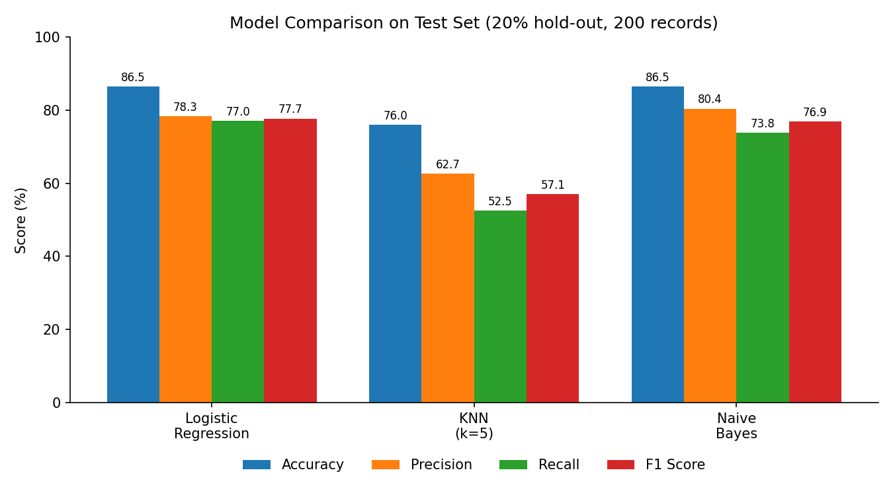
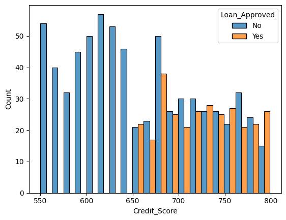

# Loan Approval Prediction System using Machine Learning

A binary classification project that predicts whether a loan application will be **approved or rejected** from applicant, financial and loan details. Three classifiers (Logistic Regression, K-Nearest Neighbors and Gaussian Naive Bayes) are trained on the same data and compared using accuracy, precision, recall and F1 score.

Built with Python, pandas and scikit-learn as part of my machine learning coursework.

## Problem Statement

Lenders have to decide quickly which applications to approve. Approving a risky applicant leads to defaults, while rejecting a creditworthy one loses business. This project builds and compares simple ML models that learn approval patterns from historical applications.

## Dataset

- **File:** `loan_approval_data.csv`
- **Size:** 1,000 records, 20 columns (18 predictive features, an applicant ID, and the target)
- **Target:** `Loan_Approved` (Yes / No)
- **Numeric features (11):** Applicant_Income, Coapplicant_Income, Age, Dependents, Credit_Score, Existing_Loans, DTI_Ratio, Savings, Collateral_Value, Loan_Amount, Loan_Term
- **Categorical features (7):** Employment_Status, Marital_Status, Loan_Purpose, Property_Area, Education_Level, Gender, Employer_Category
- **Data quality:** about 5% of values are missing in every column
- **Class balance:** roughly 70% rejected and 30% approved, which is why precision, recall and F1 are reported and not accuracy alone

## Approach

1. **Missing values:** numeric columns filled with the mean, categorical columns with the mode
2. **Exploratory data analysis:** class distribution, feature distributions, credit score by approval outcome, boxplots for outliers, correlation heatmap
3. **Encoding:** label encoding for `Education_Level` and the target, one-hot encoding (first category dropped) for the other categorical columns
4. **Split and scaling:** 80/20 train-test split (`random_state=42`), `StandardScaler` fitted on the training data only
5. **Models:** Logistic Regression, KNN (k=5), Gaussian Naive Bayes
6. **Evaluation:** accuracy, precision, recall, F1 score and confusion matrix on the 200-record test set

## Results

| Model | Accuracy | Precision | Recall | F1 Score |
|---|---|---|---|---|
| **Logistic Regression** | **86.5%** | 78.3% | **77.0%** | **77.7%** |
| K-Nearest Neighbors (k=5) | 76.0% | 62.7% | 52.5% | 57.1% |
| Gaussian Naive Bayes | **86.5%** | **80.4%** | 73.8% | 76.9% |



**Confusion matrices** (rows = actual No/Yes, columns = predicted No/Yes):

| Model | True No | False Yes | False No | True Yes |
|---|---|---|---|---|
| Logistic Regression | 126 | 13 | 14 | 47 |
| KNN | 120 | 19 | 29 | 32 |
| Naive Bayes | 128 | 11 | 16 | 45 |

### Key Takeaways

- **Logistic Regression** gave the best balance, with the highest recall and F1 score. **Naive Bayes** matched its accuracy and had the highest precision.
- **KNN** performed worst on every metric, most noticeably on recall (52.5%), meaning it missed nearly half of the applications that should have been approved.
- In the data, approved applicants had a noticeably higher credit score (about 727 on average) than rejected ones (about 652), and a lower debt-to-income ratio (about 0.25 vs 0.39).



## Limitations and Future Work

This is a learning project, and there are clear next steps:

- Results come from a single 80/20 split on 200 test records, so they can shift with a different split. **K-fold cross-validation** would give a more reliable estimate.
- Missing values were filled before splitting the data. Using a scikit-learn **Pipeline** would keep preprocessing inside the training step.
- Hyperparameter tuning (for example the value of k in KNN) has not been done yet.
- `Gender` is included as a feature. In a real lending system, sensitive attributes need careful fairness review.
- Planned: a **Streamlit** web app where a user enters applicant details and gets a prediction.

## Project Structure

```
loan-approval-prediction-ml/
├── loan_approval_system.ipynb   # full analysis and modelling
├── loan_approval_data.csv       # dataset
├── images/                      # charts used in this README
├── requirements.txt
├── .gitignore
└── README.md
```

## How to Run

```bash
git clone https://github.com/kshitij-datascience/loan-approval-prediction-ml.git
cd loan-approval-prediction-ml
pip install -r requirements.txt
jupyter notebook loan_approval_system.ipynb
```

## Tech Stack

Python · pandas · NumPy · scikit-learn · Matplotlib · Seaborn · Jupyter Notebook

## Author

**Kshitij** — BCA student aiming for Data Science and Machine Learning roles
[GitHub](https://github.com/kshitij-datascience) · [LinkedIn](https://www.linkedin.com/in/kshitij-data-ml)
